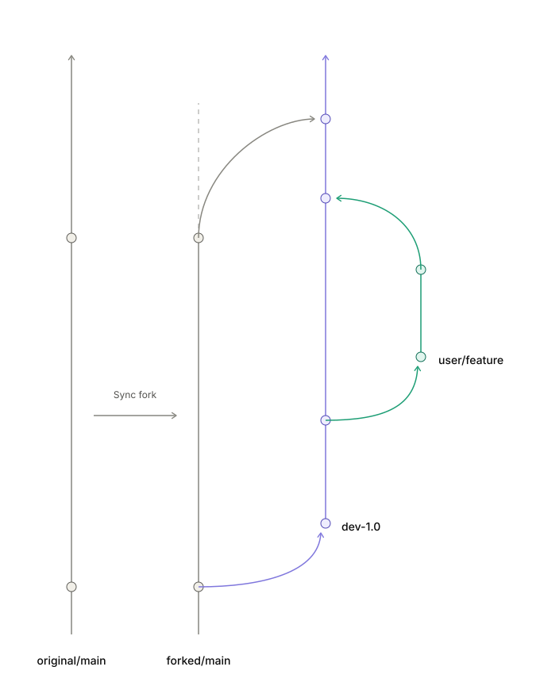

# FlagOS 运行时组 · 团队协调仓（runtime-team）

> 定位：FlagOS 运行时组协调仓，位于 **FlagRT 组织**（github.com/FlagRT/runtime-team）——文档、公共脚本、部署文件、项目骨架、版本事实源。**不含任何子库代码**（6 个子库在 FlagRT 组织下独立维护）。

## 当前状态

- 组织 FlagRT 已建：6 个子库（fork 自 flagos-ai，共同开发主干）+ runtime-team 公共仓，7 仓就位
- `FlagPerf` 是 AI 硬件评测/基准测试仓；由本仓统一 clone，但其运行依赖仍按 FlagPerf 自身文档管理，不默认并入 venv311 核心组合

## 内容规划

- `VERSIONS.md` —— 物资起始清单与版本事实源（新成员从这里起步）
- `dev/` —— 开发配置中心（各子方向开发配置/看板聚集处，结构见下节）
- `<子方向>/README.md` —— 各子方向目录入口（看板/任务/环境速查；细节各子方向自管，样式参照 `dev/memory/README.md`）

## 开发配置中心（dev/）

所有子方向的开发配置聚集于此：**各子方向成员维护自己的目录，其他成员 `git pull` 公共仓即可同步**，保证全组启动参数一致。

```
dev/
├── clone_all.sh              # 新成员一键 clone FlagRT 6 仓（团队公共）
├── compose.base.yml           # 公共资源配置：镜像/19 设备/网络/内存/驱动挂载/公共环境变量（所有子方向共享）
└── <子方向>/                 # 如 memory/；未来 kv/ 等，对应成员维护
    ├── README.md             # 本子方向看板入口（目标/任务/重要发现/环境速查）
    ├── docker-compose.yml    # 本子方向专属：-f 合并公共配置 + 容器名/专属环境变量
    ├── .env.example          # 本子方向环境变量模板：cp 成 .env 按需调整
```

使用基准：
- 日常启动：`cd dev/<子方向> && docker compose -f ../compose.base.yml -f docker-compose.yml up -d`
- 公共配置变更（镜像 tag/设备/公共环境变量）：改 `dev/compose.base.yml`，各子方向自动生效 → 同步 `VERSIONS.md`
- 子方向专属变更：改本子方向的 `docker-compose.yml` / `.env.example` / 看板
- 每个子方向 compose 必须声明独立 `name:`（如 `flagos-<方向>`）：默认 project 取首个 -f 文件目录名（`dev`），不声明会跨方向重建同名 `runtime-dev` 服务
- `.env` 不入仓；需要 docker compose v2（-f 多文件合并，后文件覆盖前文件；序列字段如 `devices` 需整值替换时用 `!override`，compose ≥2.24，`!reset` 会清空）

## 目录布局约定（嵌套布局）

公共仓根 = 开发总目录：clone 公共仓后，6 个子库由 `clone_all.sh` 收拢进公共仓根目录内部，所有开发都在公共仓根目录内进行。

```
runtime-team/                  # 公共仓根 = 开发总目录（clone 到任意位置）
├── README.md / VERSIONS.md / .gitignore
├── dev/                       # 开发配置中心
│   ├── clone_all.sh           # 一键对齐 6 子库（默认收拢到公共仓根）
│   ├── compose.base.yml       # 公共资源配置（所有子方向共享）
│   └── memory/                # memory 子方向（看板 + compose + .env.example + probes/）
├── PyTorch-Plugin-FL/         # 6 个子库（独立 git 仓库，各自 fork 管理，不进本仓）
├── FlagCX/
├── FlagGems/
├── vllm-plugin-FL/
├── FlagTree/
└── FlagPerf/
```

路径原则：
- **宿主侧零配置**：挂载点由 `compose.base.yml` 相对路径 `../` 自动解析为公共仓根（相对路径按首个 -f 文件所在目录解析）
- **容器侧为固定约定**：公共仓根挂载为 `/workspace`，宿主 `<公共仓根>/PyTorch-Plugin-FL` ⇔ 容器 `/workspace/PyTorch-Plugin-FL`；`FLAGCX_PATH`、探针 `/workspace/dev/memory/probes/` 等均按此约定
- 设备/驱动节点（`/dev/davinci*`、`/usr/local/Ascend/driver`）为机器固有路径，与代码布局无关

## 新成员起步

**前置**：GitHub SSH key 已上传（Settings → SSH and GPG keys）、已是 FlagRT 组织成员（clone_all.sh 会自动预检认证，失败即退出）。

**起步链路**：

```bash
# 1. clone 公共仓（任意位置；公共仓根 = 你的开发总目录）
git clone git@github.com:FlagRT/runtime-team.git
cd runtime-team

# 2. 一键对齐 6 个子库（缺失 → clone，已存在 → 更新到最新；分支见 VERSIONS.md §1）
bash ./dev/clone_all.sh

# 3. 进入目标子方向，按该子方向 README 启动容器（如 memory → dev/memory/README.md「启动容器」）
cd dev/<子方向>
```

**通用验证**（任意子方向容器内）：`ls /workspace` 应看到 6 个子库 + 公共仓内容（容器名/进入方式见各子方向 README）。

**要点**：
- 起容器前：`npu-smi` 确认卡空闲；DrvMng 并发容器上限 ≈3，容器名冲突时先 `docker stop` 旧容器
- 日常开发：`cd <子库> && git checkout <协作分支>`（各仓分支见 `VERSIONS.md` §1；FlagTree 用 `triton_v3.2.x`）→ 建个人分支 → push 组织仓 → 同仓 PR
- 公共配置变更（镜像/设备/环境变量）：改 `dev/compose.base.yml`，各子方向自动生效，并同步 `VERSIONS.md`；子方向专属变更改各自目录
- 细节与踩坑：各子方向看板（如 `dev/memory/README.md`）＋ `VERSIONS.md`（物资清单/镜像/venv 组合）

## 协作纪律

- 上游 flagos-ai 6 库（只读参照）→ **FlagRT 组织仓（共同开发主干，成员直接 clone，无需 fork）** → 本地分支 → push → 同仓 PR
- 日常开发：从各仓 `VERSIONS.md` §1 指定的协作分支创建 `git checkout -b <名字>/<功能>` → push 组织仓同名分支 → PR 合入 `dev-1.0`（1 人 review）；阶段验收后由 `dev-1.0` 正式 PR 进 `main`
- 上游同步由组织仓 **Sync fork** 按钮统一负责，成员 `git pull` 即得最新

## 红线

- 不改宿主机器配置/驱动；所有安装与实验都在容器内进行
- 多卡测试前 `npu-smi` 确认 16 卡空闲；DrvMng 并发容器上限 ≈3，超了先停旧容器
- 昇腾跑 vLLM 推理（设备层通用坑）：首次 attention 算子初始化极慢（10+ 分钟），基准前先短请求预热；`docker exec` 被 kill 会残留 EngineCore 子进程占卡，重跑前 `pkill -f "VLLM::EngineCore"`
- 公共仓内容逐项审查后才上传；个人调试记录默认收拢 `personal/` 不上传

## 分支模型（fork 三线 · GitFlow develop 模式）

<div align="center">



</div>

6 个子库 fork 自上游 flagos-ai，在 FlagRT 组织仓里用三条线干活：

| # | 规则 | 大白话 |
|---|------|--------|
| 1 | **main 只同步、不开发** | main 专门用来 Sync fork 拉原仓库的新东西，永远别在它上面提交自己的代码 |
| 2 | **dev-1.0 是公共开发分支** | 所有人的开发分支最终都合并到 dev-1.0，大家在这条线上协作 |
| 3 | **上游新特性，看需要才合** | dev-1.0 想用上游的新功能，就把 main 合并进来；不想用就不合，完全没问题 |

- `main`：**稳定主线**。唯一变更来源 = ① fork sync（上游同步）② `dev-1.0` 的验收 PR
- `dev-1.0`：**团队公共开发分支**（develop 角色，公共版本线 1.0）。所有个人分支在此汇合、集成测试，验收后 PR 进 main。命名与子方向内部版本解耦（如 memory 子方向的 2.4 是其内部代号）；后续公共版本线依次建 `dev-2.0` 等，同样汇 main
- 铁律：共享分支（main / dev-1.0）只用 merge，不用 rebase

**规范（自建仓，如 runtime-team）**

- 所有直接 commit / rebase 只发生在用户开发分支
- `dev-1.0` 只接受用户开发分支的 merge（本地自行 merge 后 push 即可）
- `main` 只接受 `dev-1.0` 的 merge（只能走正式 PR）
- 同步动作走「标准提交流程」五步（见下文 §标准提交流程 / `dev/sync_to_dev.sh`）

**规范（fork 仓，如 6 个子库）**

- 所有直接 commit / rebase 只发生在用户开发分支
- `dev-1.0` 只接受：① 用户开发分支的 merge（本地自行 merge 后 push 即可）② `main` 的 merge（追上游新特性）
- `main` 只接受 sync-fork 的更新（网页 **Sync fork**，不手动改）

**记住两句**

- main 上**不能**直接开发 —— 它是同步专用的。
- 不合并 main **不会怎样** —— 只是 dev-1.0 暂时没有上游的新功能而已。

> 例外：FlagTree 的基准分支是 `triton_v3.2.x` 而非 main（上游按 triton 大版本分支维护，昇腾绑 3.2）；FlagGems 的同步分支名为 `master`（fork 默认分支非 main）。各仓基准分支以 `VERSIONS.md` §1 为准。

## 上游同步

- 组织仓保留 fork 状态：`main` 同步上游用网页 **Sync fork** 按钮；fork 仓的 `dev-1.0` 追上游 = merge `main`（`git checkout dev-1.0 && git merge origin/main`，main 已 sync 上游）
- 纪律：每周至少一次；冲突当场解决并记录；共享分支只用 merge，不用 rebase

## 标准提交流程（个人开发分支 → dev-1.0）

自建仓（runtime-team）把个人分支变更同步进 `dev-1.0` 的固定五步，全程只 merge 不 rebase；一键脚本：`bash dev/sync_to_dev.sh`（在个人分支上、工作区干净时执行）。

前提：变更已 commit 在个人开发分支（`<名字>/<功能>`），工作区 clean。

```bash
# 1. 远端 dev 同步到本地 dev-1.0（必须快进，不产生新提交）
git fetch origin
git checkout dev-1.0
git merge --ff-only origin/dev-1.0

# 2. dev-1.0 merge 进个人分支（冲突只在这里解决，解决后从第 1 步重来）
git checkout <名字>/<功能>
git merge --no-ff dev-1.0 -m "Merge dev-1.0 into <名字>/<功能>"

# 3. 处理好的个人分支合入本地 dev-1.0
git checkout dev-1.0
git merge --no-ff <名字>/<功能> -m "Merge <名字>/<功能> into dev-1.0: <一句话摘要>"

# 4. 校验远端无分叉（origin/dev-1.0 是本地 dev-1.0 的祖先）后推送
git fetch origin
git merge-base --is-ancestor origin/dev-1.0 dev-1.0 && echo "OK 无分叉" || echo "STOP 远端已分叉，回第 1 步"
git push origin dev-1.0

# 5. 回个人分支，结束
git checkout <名字>/<功能>
```

中止条件：第 1/4 步非快进、第 2/3 步合并冲突、第 4 步远端分叉 —— 停下处理后重跑。`dev-1.0` 无需 PR（`main` 才走正式 PR）；个人分支是否 push 组织仓由本人决定，不影响本流程。
